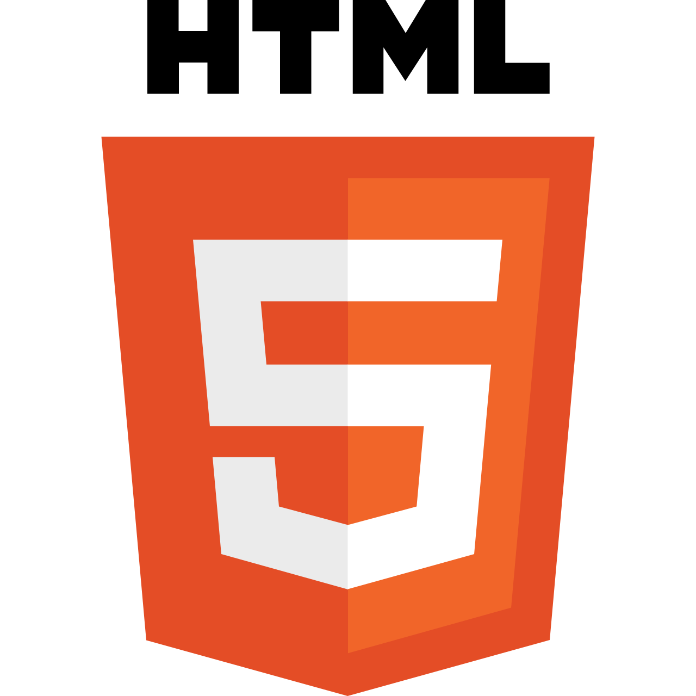
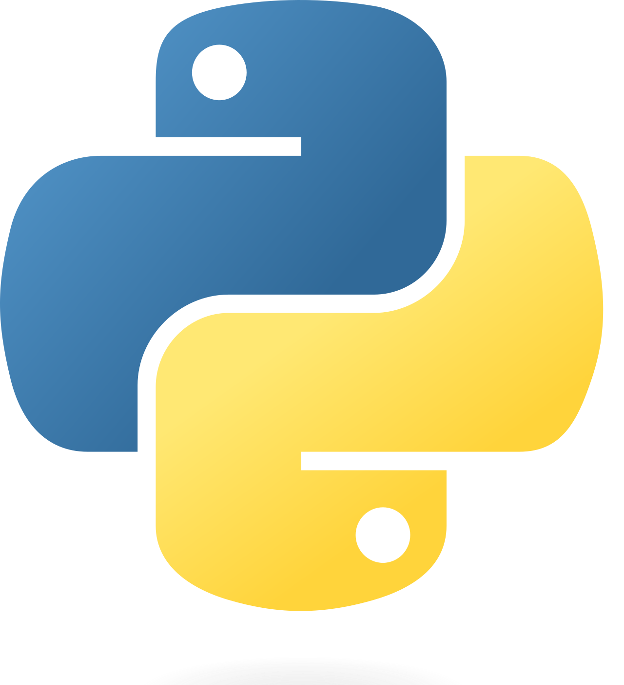
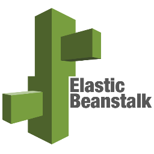

# Online Calculator
This is a simple HTML and Python code for an online calculator that performs arithmetic operations based on user input.

How it works
The HTML code provides a basic user interface for the calculator. It includes input fields for the two numbers to be operated on and a dropdown list for selecting the operation to be performed. When the user clicks the "Calculate" button, the form is submitted to the Python code running on the server.

The Python code, implemented using Flask, handles the user input and performs the selected operation. It then returns the result to the HTML code, which displays it on the page. Make sure python is installed on your machine. Run pip install flask. Run python ebs-calc.py. Open your browser and navigate to http://127.0.0.1:5000. Do some calculations :]

How to use it (make sure to follow the ste)
Run the Python code on a server by executing it in a terminal or command prompt. Once the server is running, open a web browser and navigate to the server's URL to access the calculator. (see above)

Logic behind it
The Python code uses Flask to create a web application with a single route ("/") that handles both GET and POST requests. When a GET request is received, the code returns the HTML file, which is rendered using Jinja2 templates. When a POST request is received, the code retrieves the user input from the form and performs the selected operation. The result is then returned to the HTML file, which displays it on the page using Jinja2 templating.

The code performs basic error checking to ensure that the user input is valid and that division by zero does not occur.

# Deployment on Elastic Beanstalk
To deploy this web application on Elastic Beanstalk, follow these steps:

Create a virtual environment with Flask installed. Make sure that your application is called "application.py". You can then pull up AWS and launch EBS. Once there, create a new enviornment. Select Web server environment, add the name of your application, select the Python platform with the latest version. Then, click next. Skip the rest of the steps and click on skip to review. Wait a little bit and then your environment will be up and running. Once everything is running, go to CodePipeline. Connect using GitHub. Make sure your Github account is connected to AWS. Follow the prompts on CodePipline. Skip build and go to deploy. Deploy provider-> AWS EBS, select your region, choose your application name/environment name. Create the pipeline. When done, click on your application and then click on the domain. There is your webapp! This is a live address that can be used and you can add a custom domain using Route53. Any changes made will also reflect on your webapp (CI/CD). 
# Technologies used overview:

